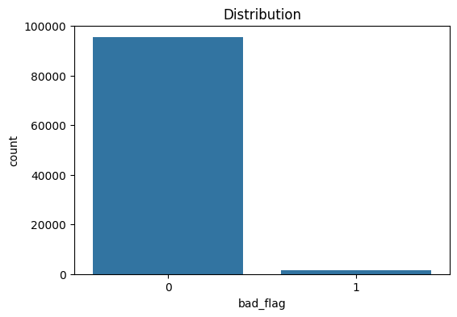
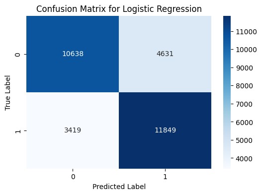

# CONVOLVE-3.0
# Credit Card Default Prediction

## Problem Understanding and Objective
The goal of this project is to predict the probability of default for a set of credit card customers using historical data. The dataset contains features representing various behaviors and demographics of credit card holders. The target variable `bad_flag` indicates whether the customer defaulted (`bad_flag = 1`) or did not default (`bad_flag = 0`).

We train a machine learning model using the development data and apply it to the validation data to predict the default probability for each customer.

## Approach and Methodology

### Step 1: Data Loading and Preprocessing
- Load data using `pandas.read_csv()`.
- Handle missing values with median imputation for numerical features.
- Exclude irrelevant columns such as `account_number`, `bureau_436`, and `bureau_447`.
- Separate relevant features and the target variable (`bad_flag`).

### Step 2: Exploratory Data Analysis (EDA)
- **Distribution of Target Variable:** Analyze class distribution using a count plot.
  
  
  
- **Null Values Analysis:** Check for missing values to decide on handling strategies.

### Step 3: Addressing Class Imbalance
- Use **SMOTE (Synthetic Minority Over-sampling Technique)** to balance the dataset since the `bad_flag` variable is likely imbalanced.

### Step 4: Data Splitting
- **Train-Test Split:** 80-20 split ensures training on 80% and validation on 20% of the data.
- **Stratified Split:** Maintains the proportion of defaulting and non-defaulting customers.

### Step 5: Feature Scaling
- Apply **StandardScaler** to normalize feature values (zero mean, unit variance) for models like Logistic Regression and Random Forest.

### Step 6: Model Selection
The following models were evaluated:
- **Random Forest** (Selected Model)
- XGBoost
- LightGBM
- CatBoost
- Logistic Regression

### Step 7: Model Training and Evaluation
#### **Random Forest Performance:**
- **Precision:** Class 0 - 1.00, Class 1 - 0.68
- **Recall:** Class 0 - 1.00, Class 1 - 0.68
- **F1 Score:** Class 0 - 1.00, Class 1 - 0.81
- **Confusion Matrix:**
  
  
  
#### **Comparison with Other Models:**
| Model       | AUC   | F1 Score |
|------------|------|----------|
| XGBoost    | 0.9985 | 0.9937 |
| LightGBM   | 0.9982 | 0.9935 |
| CatBoost   | 0.9982 | 0.9935 |
| Logistic Regression | 0.7945 | 0.7464 |

### Step 8: Prediction and Output Generation
- The trained **Random Forest model** predicts the `bad_flag` for the validation dataset.
- Results are saved as `predictions.csv` with columns: `account_number` and `bad_flag`.

## Key Insights and Observations
- **Imbalanced Data:** SMOTE effectively mitigated class imbalance.
- **Feature Importance:** Features like payment history and demographics influenced predictions.
- **Best Model:** Random Forest demonstrated a good balance between recall and precision.

## Conclusion
This project successfully predicts credit card defaults using a **Random Forest model**. Key steps included:
- Handling class imbalance with **SMOTE**.
- **Feature scaling** for improved performance.
- **Model evaluation** using AUC, F1 Score, and confusion matrix.

Random Forest was selected for final implementation due to its strong predictive performance. Future improvements could involve hyperparameter tuning and ensemble techniques.

---
**Author:** Your Name  
**Date:** February 2025
